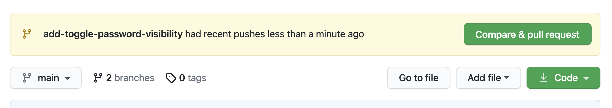
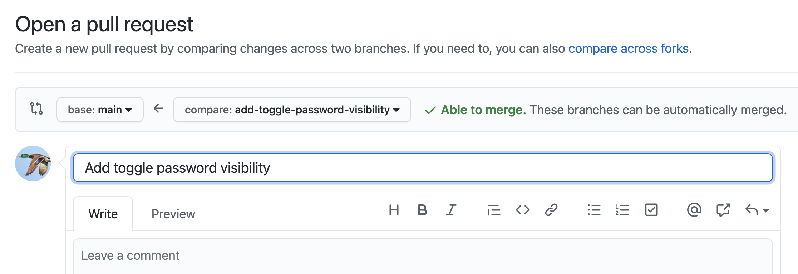
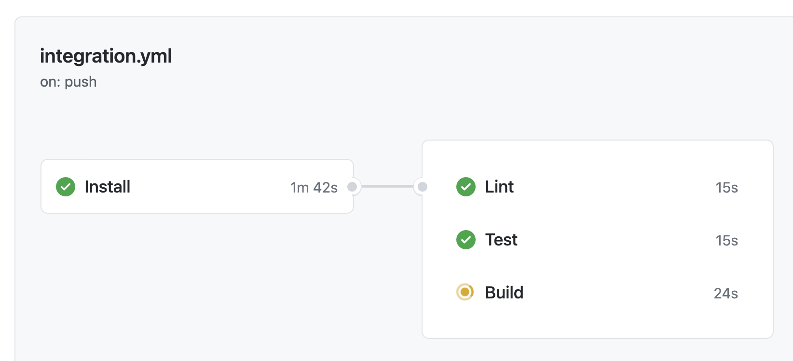
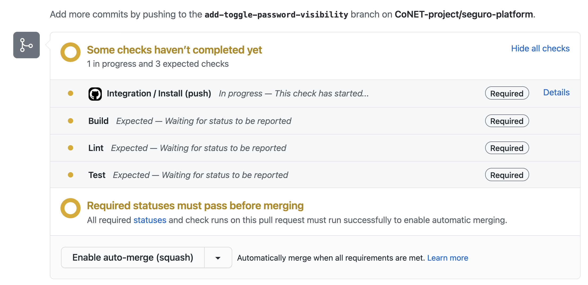
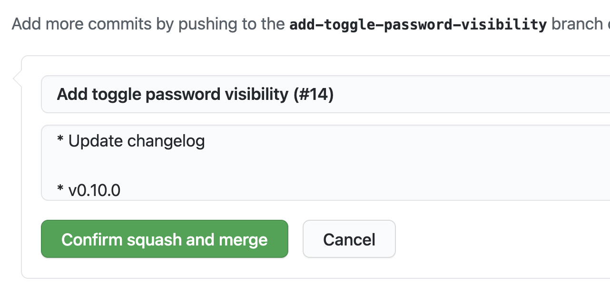
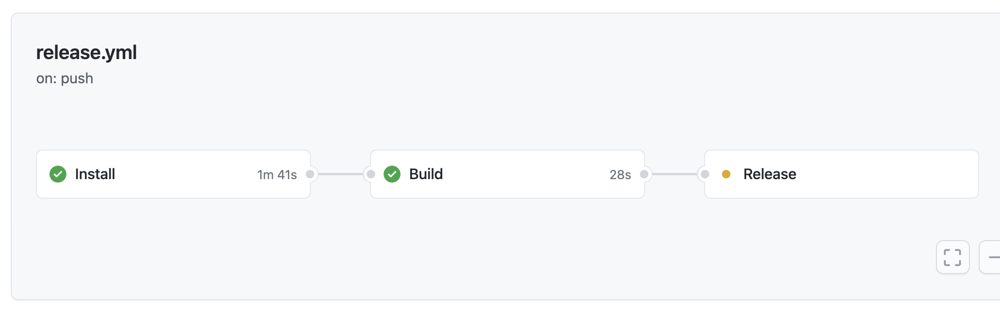
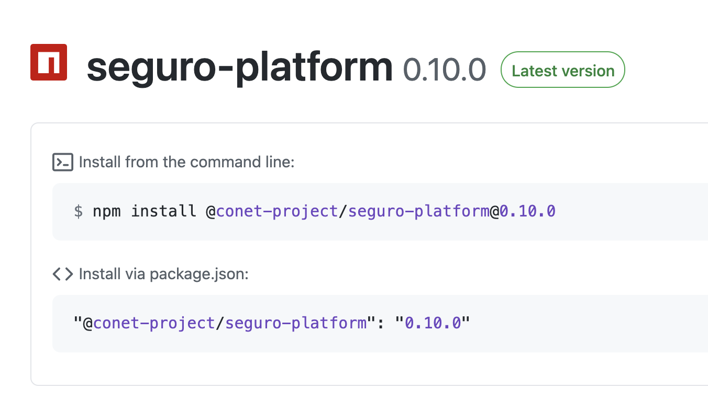

# Development Process

This document describes the step-by-step process to follow when developing on the Seguro Platform project.

## Create Feature Branch

Ensure that your local `main` branch reflects the latest code from `origin/main`:

```bash
git checkout main && git pull
```

Create a feature branch based off of the latest `main` branch:

```bash
# git checkout -b [branch-name]
$ git checkout -b add-password-visibility-toggle
```

The feature branch title should describe what the feature does at the highest level, using verb-noun naming in the imperative tone:

- `add-password-visibility-toggle`
- `remove-password-visibility-toggle`
- `fix-password-visibility-toggle`

Use the module name as a scope if relevant:

- `messages/update-online-status`

## Develop

This section is a work-in-progress!

### Adding Tests

This section is a work-in-progress!

### Adding Dependencies

This section is a work-in-progress!

### Adding Documentation

This section is a work-in-progress!

## Commit Changes

Use the imperative tone for commit messages:

```bash
# git commit [file-list] -m [commit-message]
$ git commit changed-file.ts -m 'Add a password visibility toggle option'
```

## Bump Package Version

Bump the package version using the command `yarn version [flag]` with one of the following flags:

- `--major` (example: `0.1.2` to `1.0.0`)
  - Use this when the change majorly breaks backwards compatibility.
- `--minor` (example: `0.1.2` to `0.2.0`)
  - Use this when the change does not (majorly) break backwards compatibility.
- `--patch` (example: `0.1.2` to `0.1.3`)
  - Use this when the change fixes something that was broken as a result of incorrect code.

This command will automatically modify the `version` field of `package.json` and immediately commit the change.

## Update Changelog

Modify the `CHANGELOG.md` file to describe the changes.

At the bottom of the file you will find a template:

```
## `major.minor.patch`

### Additions

- None.

### Changes

- None.

### Fixes

- None.
```

Copy and paste the entire block to the top of the document, then:

- Replace the `major.minor.patch` text with the new version.
- Add bullet points describing additions, changes, and fixes where relevant.
- Add a line separator to the bottom `---`.

```
# CHANGELOG

## `0.2.0`

### Additions

- Add password toggle.

### Changes

- None.

### Fixes

- None.

---
```

Just like feature branch naming, it's a good idea to prefix points with the name of their module if your project deals with many concerns:

```
### Additions

- Messages: Add contact profile picture.
- Launcher: Add toggle password visibility option.
```

Commit your changes:

```bash
# git commit CHANGELOG.md -m [commit-message]
$ git commit CHANGELOG.md -m 'Update changelog'
```

## Push Feature Branch

When your feature is complete and fully committed locally, push the branch to the remote origin on GitHub:

```bash
# git push -u origin [branch-name]
$ git push -u origin add-password-visibility-toggle
```

## Open Pull Request

On GitHub, open a pull request to merge your branch into main:





At any point in the pull request process, code can be committed to the feature branch and pushed to GitHub, where the pull request will reflect the latest version.

### Continuous Integration Pipeline

The CI pipeline will run on your branch when it is pushed, or when a pull request has been opened.

The current status of the pipeline can be viewed in the GitHub "actions" pane, or in the pull request itself:





If the pipeline passes, your feature branch will be able to be merged into the main branch.

### Code Review

Once the CI pipeline has passed, notify the relevant stakeholders on the team so that they may review the pull request and approve it.

## Merge Pull Request

Once the pull request has been approved, use the "squash merge" button to merge the branch into the main branch.

The squash merge message should describe what the feature does at the highest level.

If the branch is named `add-password-visibility-toggle`, the merge commit message should be titled "Add password visibility toggle". GitHub will do this by default:



When the merge process has been engaged, the pull request branch will be automatically deleted from the origin server.

On your local machine, switch back to the main branch and pull the latest version:

```bash
git checkout main && git pull
```

## Release Package

### Continuous Release Pipeline

Once the feature branch has been merged into the main branch, the CR pipeline will run.

On most Seguro Platform projects, this means that an NPM package of the project will be built and published to the internal GitHub NPM packages repository.

As with the CI pipeline, the current status can be viewed in the GitHub "actions" pane:



View the "packages" pane of the repository on GitHub to ensure that a package for the latest version has been published:



Other projects may depend on this new version:

```bash
# yarn add [optional-development-flag] @conet-project/[package-name]@latest
$ yarn add --dev @conet-project/seguro-bridge-lib@latest
```

## More Information

This document is a work-in-progress!
